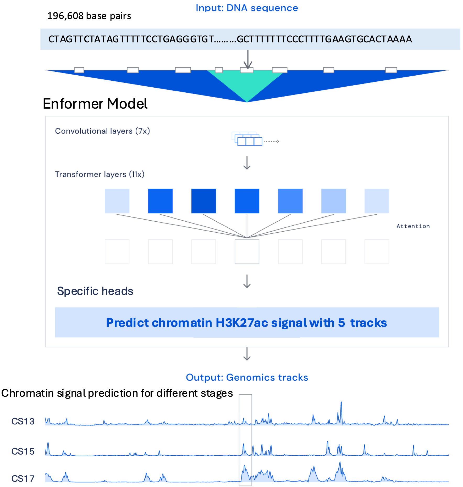

# Finetuning Enformer on Human Embryonic H3K27ac Chromatin Signals

This repository contains code and pipelines for:

- **Finetuning the Enformer model** on imputed H3K27ac chromatin signal data
- **Predicting stage-specific enhancer activity** across Carnegie developmental stages
- **Performing variant effect analysis**, including comparisons between functional and non-functional regulatory variants

## 📌 Overview
Chromatin signals such as H3K27ac mark active promoters and enhancers, reflecting regulatory activity during development.

We train Enformer to learn these chromatin landscapes and use the finetuned model to analyze stage-specific regulation and the functional impact of genomic variants.

## 📂 Data
### 1. Description

We use imputed H3K27ac −log10(p-value) signal bigWigs as model targets. These signals represent:

- active regulatory regions
- promoters and enhancers
- open chromatin features

#### Carnegie Stages (CS)
Carnegie stages classify human embryos into 23 morphological stages during the first 8 weeks after fertilization. We analyze 5 stages:

| Stage	| Embryo Replicates |
|---|:---|
| CS13	| 12383, 12690, 12829, 12830, 12877 |
| CS14	| 12408, 12709, 12913 |
| CS15	| 13000, 13019, 13128 |
| CS17	| 12191, 12331, 12341, 12611 |
| CS20	| 12104 |

Each replicate contains:

- a **bigWig** signal file (*_H3K27ac.pval.signal.bigWig)
- a **bigBed** peak call file (*_H3K27ac_peaks.gappedPeak.bed)

### 🧹 2. Data Preprocessing
We preprocess both signal and peak data for each stage.
#### 2.1 Combine bigWig files

All bigWigs for a given stage are averaged using ```bigwigAverage``` from from deepTools:
```
bigwigAverage -b \
  impute_CS13-12383_H3K27ac.pval.signal.bigWig \
  impute_CS13-12690_H3K27ac.pval.signal.bigWig \
  impute_CS13-12829_H3K27ac.pval.signal.bigWig \
  impute_CS13-12830_H3K27ac.pval.signal.bigWig \
  impute_CS13-12877_H3K27ac.pval.signal.bigWig \
  -o CS13_H3K27ac.mean.pval.bw
```

#### 2.2 Combine peak BED files
Steps:
1. Convert bigBed → BED
2. Concatenate all replicate peak files
3. Sort by genomic position
4. Merge overlapping intervals using ```bedtools```

Example:
```
cat impute_CS13*_H3K27ac_peaks.gappedPeak.bed \
  | cut -f1-3 \
  | sort -k1,1 -k2,2n \
  > CS13_all_peaks.sorted.bed

bedtools merge -i CS13_all_peaks.sorted.bed \
  > CS13_H3K27ac.union_peaks.bed
```
#### 2.3 BED Region Post-processing

- Center each union peak
- Extend to Enformer effective prediction sequence length (114,688 bp) (Input sequence length is 196,608 bp)
- Remove intervals exceeding chromosome bounds

### 🎯 3. Target Generation

Enformer predicts **896 bins**, each representing **128 bp**, for a total sequence window of **114,688 bp**.

#### Steps:
- Extract binned signal using bigWig statistics:
```
values = bw.stats(chr_name, start, end, nBins=896, type="sum")
```
- Compute sum or mean across 128 bp
- Apply log1p to stabilize the distribution

### 🧪 4. Data Split

Chromosome-based train/val/test split:

| Split	| Chromosomes| 
|---|:---|
| Train	| chr1, chr3–7, chr9–22, chrX | 
| Validation |	chr8
| Test | chr2, chr10

This prevents sequence leakage across sets (We excluded: chrY).

## 🧬 Enformer Model

<a href="https://deepmind.com/blog/article/enformer">Enformer</a> (DeepMind, 2021) is a transformer-based model for long-range regulatory sequence modeling.

</img>

#### Modifications for this project

- Replace Enformer’s original output head with a 5-track regression head
(one track for each Carnegie stage: CS13, CS14, CS15, CS17, CS20)
- Finetune the new head + selected upper layers
- Optimize using MSE or Poisson regression loss

</img>

## 🚀 Usage
### Install
```
$ pip install enformer-pytorch
```
### Training
```
python enformer_pytorch/train.py \
    --model-name H3K27ac_batchsize_4_lr1e-5_clip0.5_noamp_chromsplit811 \
    --num-tracks 5 \
    --batch-size 4 \
    --num-workers 2 \
    --print-every 50 \
    --log-every 50 \
    --log-grads \
    --grad-log-every 50 \
    --clip-grad 0.5 \
    --lr 1e-5 \
    --no-amp \
    --rc-aug
```

## 📈 Experimental Results
### 1. Chromatin Signal Prediction

For each test sequence:

- Extract 196,608-bp reference region
- Predict H3K27ac signal for all 5 stages
- Compare predicted vs. observed signals

Visualizations include:

### 2. Variant Effect Analysis
#### (1) Single Variant Δ Prediction

Given a variant:

- Extract the reference sequence
- Create the mutated sequence
- Run both through the model

Compute the effect:
```
diff = y_alt - y_ref
```

Used to identify:

- enhancer gain/loss
- stage-specific regulatory disruptions

#### (2) IRF6 Variant Group Analysis

Variants are grouped into:

- Functional variants
- Non-functional variants

For each variant:

- Compute delta score
```Python
# bin-wise differences
delta_bins = y_alt - y_ref                      # (B, T)
logfc_bins = np.log2((y_alt + eps) / (y_ref + eps))
```
- Summarize distributions
- Perform statistical tests (Mann–Whitney U, t-test)
- Compute classification AUC

Visualizations:

violin / box plots

scatter plots

ROC curves

## 📁 Repository Structure

├── data/
│   ├── raw/
│   ├── bigwig/
│   ├── bigbed/
│   ├── processed/
│   └── peaks/
├── src/
│   ├── preprocessing/
│   ├── enformer/
│   ├── training/
│   ├── evaluation/
│   └── variant_effect/
├── notebooks/
├── results/
│   ├── predictions/
│   ├── figures/
│   └── variant_effects/
└── README.md

📚 Citation

Please cite the Enformer paper and relevant datasets as appropriate.

📨 Contact

For questions or contributions, feel free to open an Issue or Pull Request.
